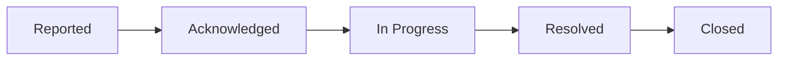
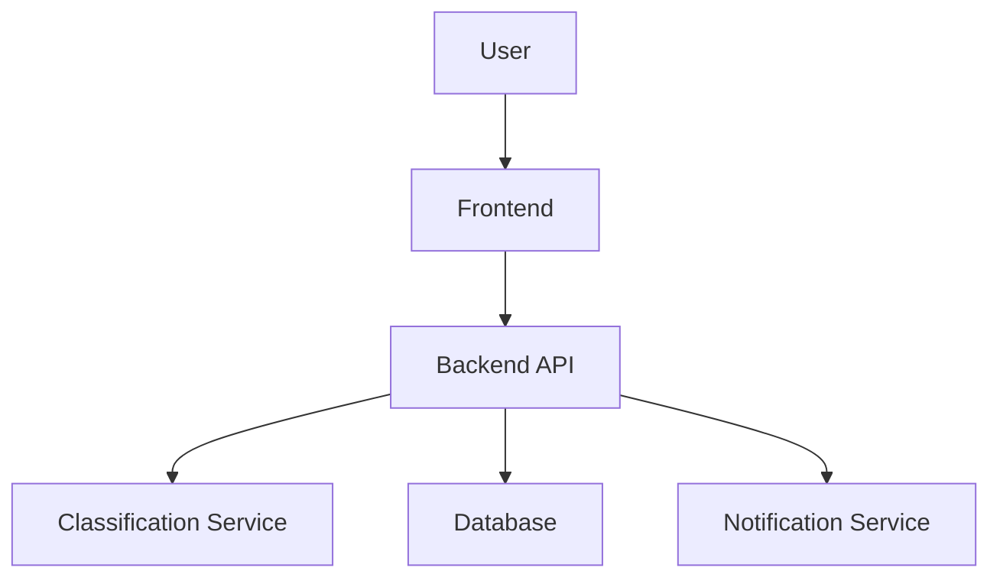

# IssueOps
AI-powered campus issue reporting system that categorizes complaints, routes them to the right departments, detects duplicates, and prioritizes high-frequency issues while providing real-time status tracking for faster resolution.

---

## 📌 Overview

A **centralized platform** for students to report campus/hostel issues, automatically categorize them, and track resolution in real-time.

✨ Key highlights:
- Smart issue categorization
- Duplicate detection
- Priority escalation
- Real-time tracking
- Admin analytics dashboard

---

## ❗ Problem

- No centralized reporting system
- Issues lost in WhatsApp/email
- No tracking or accountability
- Duplicate complaints not handled
- Slow resolution

---

## 💡 Solution

A system that:

- 📥 Collects issues from students
- 🤖 Automatically categorizes them
- 🏢 Assigns to correct departments
- 📊 Tracks status lifecycle
- 🔥 Escalates high-frequency issues

---

## 🧩 Features

### 📝 Issue Reporting
- Title, Description
- Location (Hostel/Block)
- Category (manual/auto)
- Optional image upload

---

### 🤖 Smart Categorization

| Input | Category |
|------|--------|
| Water leakage | Plumbing |
| Light not working | Electrical |
| WiFi issue | IT |

---

### 🔄 Status Lifecycle

---

### 🔁 Duplicate Detection

- Uses similarity matching
- Merges duplicate issues
- Increases report count

---

### ⚡ Priority Engine

| Reports | Priority |
|--------|---------|
| 1 | Low |
| 2-4 | Medium |
| 5+ | High |

---

### 📊 Admin Dashboard

- Total Issues
- Pending Issues
- Resolution Time
- Department Performance

---

## 👥 User Roles

| Role | Capabilities |
|-----|-------------|
| Student | Report & track issues |
| Staff | Update & resolve issues |
| Admin | Monitor & manage system |

---

## 🏗️ System Architecture

---

## ⚙️ Tech Stack

### Frontend
- React / Flutter

### Backend
- FastAPI / Node.js / Spring Boot

### Database
- PostgreSQL / MongoDB

### AI/NLP
- Scikit-learn / BERT

### Notifications
- Firebase / Email / SMS

---

## 🗄️ Database Design

### Users
- user_id
- name
- role

### Issues
- issue_id
- title
- category
- status
- priority

### Reports
- report_id
- issue_id
- user_id

---

## 🔔 Notifications

- Issue acknowledged
- Issue resolved
- High-priority alerts

---

## 📈 Success Metrics

- ⏱️ Resolution time ↓
- 📊 Issue completion rate ↑
- 😊 Student satisfaction ↑
- 🔁 Duplicate reports ↓

---

## 🚀 Future Enhancements

- AI-based classification
- Image-based detection
- Chatbot reporting
- Mobile app
- Predictive maintenance

---

## 🧠 Interview Summary

> This system uses a frontend for reporting, a backend for processing, an NLP-based classification service for categorization, and a database for storage. Duplicate detection and priority engines ensure efficient handling, while notifications keep users updated.

---

## 📜 License

MIT License
